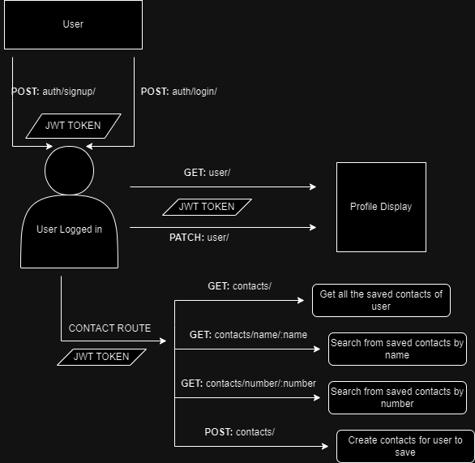

## Description

A [Nest JS](https://github.com/nestjs/nest) backend for saving contacts with user registration and login.

## Installation

After copying the repo to your local environment
```bash
$ cd contact-book
```

Setup node modules
```bash
$ npm install
```

Run the app
```bash
$ npm run start:dev
```

Setting up docker-compose file
```bash
$ docker compose up dev-db -d
```

Setup .env file and then run prisma
```bash
$ npx prisma studio
```

## Demo

A diagram of the whole backend route flow and working.


